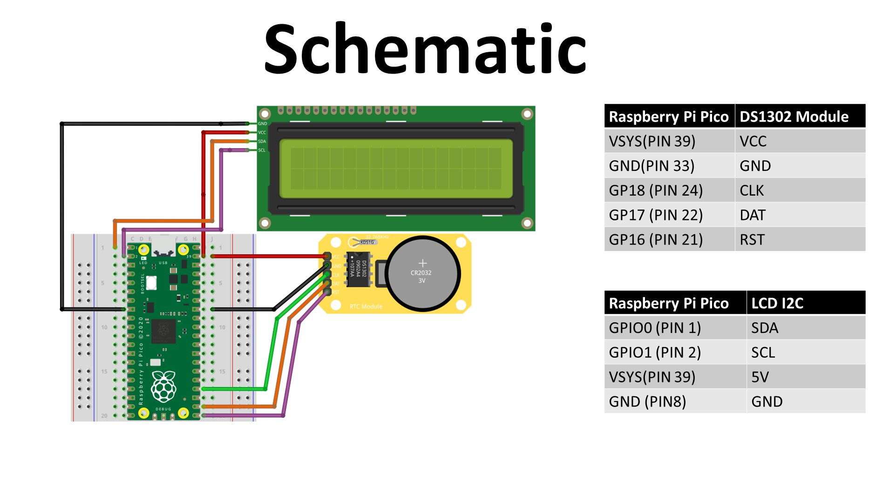

# DS1302 +  16x2 Character LCD 

Youtube link: https://youtu.be/5jylVizMTa8

This tutorial we will take a look at the **DS1302** real-time clock module. We will connect it to the Raspberry Pi Pico to display the date and time on the popular **16x2 Character LCD with I2C**.

## DS1302

The DS1302 trickle-charge timekeeping chip contains a real-time clock/calendar and 31 bytes of static RAM. It communicates with a microprocessor via a simple serial interface. The real-time clock/calendar provides seconds, minutes, hours, days, dates, months, and year information.

## Components Required

To follow along with this tutorial, you will need the following components:
-   Raspberry Pi Pico
-   16x2 Character LCD
-   The DS1302 module also ensures that you have a 1.5V cell.

## Schematic Diagram
Build your circuit according to the following schematic:

## Libraries
For this tutorial you will need the following Libraries, which is included in this repository, for more information you can use the following links to see the repository of the creator of the libraries:

RPI-PICO-I2C-LCD - https://github.com/T-622/RPI-PICO-I2C-LCD
DS1302 RTC Clock driver - https://github.com/omarbenhamid/micropython-ds1302-rtc

## Code
Import all the libraries  
    
    from machine import I2C, Pin
    import utime
	import ds1302
	from lcd_api import LcdApi
	from pico_i2c_lcd import I2cLcd

  To setup your I2C you need to know the address of your device, in this case mine is 63.

	I2C_ADDR     = 63
	I2C_NUM_ROWS = 2
	I2C_NUM_COLS = 16

To find your I2C address run the following script on your pico to receive your address in the terminal.

	import machine
	sda = machine.Pin(0)
	scl = machine.Pin(1)
	i2c = machine.I2C(0,sda=sda,scl=scl, freq=400000)
	print(i2c.scan())

Now we can initialize our I2C communication and LCD setting it equal to the variable i2c and lcd.

	i2c = I2C(0, sda=machine.Pin(0), scl=machine.Pin(1), freq=400000)
	lcd = I2cLcd(i2c, I2C_ADDR, I2C_NUM_ROWS, I2C_NUM_COLS)
 
 Now setup the Real-Time Clock by initializing it with the ds1302 library and we will set it equal to the variable ds.
 
	ds = ds1302.DS1302(Pin(18),Pin(17),Pin(16))

To set the time you need to change the following code with the correct information. After uploading the program comment out this line.

	ds.date_time([2023, 3, 2, 0, 8, 17, 50]) # set datetime.

We can now create an endless loop to write the year, month, day, hour, minute and second to our screen. We first format the date with the following code. 

	while True:
   		(Y,M,D,day,hr,m,s)=ds.date_time()
    	if s < 10:
            s = "0" + str(s)
        if m < 10:
            m = "0" + str(m)
        if hr < 10:
            hr = "0" + str(hr)
        if D < 10:
            D = "0" + str(D)
        if M < 10:
            M = "0" + str(M)

Last step is to display the time and date on the LCD, using the LCD library we can move the cursor to any starting position
on our LCD and put information with the **putstr** function.

    lcd.move_to(0,0)
    lcd.putstr("Time:")
    lcd.move_to(6,0)
    lcd.putstr(str(hr) + ":" + str(m) + ":" + str(s))
    lcd.move_to(0,1)
    lcd.putstr("Date:")
    lcd.move_to(6,1)
    lcd.putstr(str(D) + "/" + str(M) + "/" + str(Y))
    
Feel free to contribute to this code or repository to make it more efficient.
