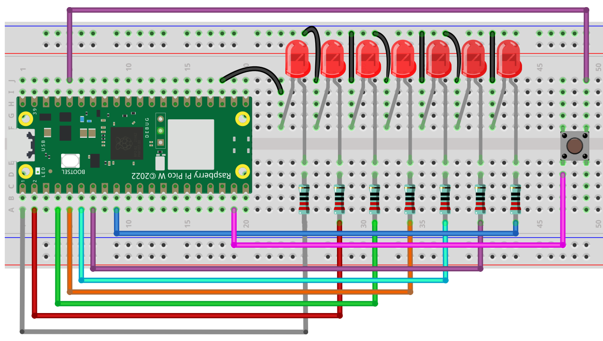
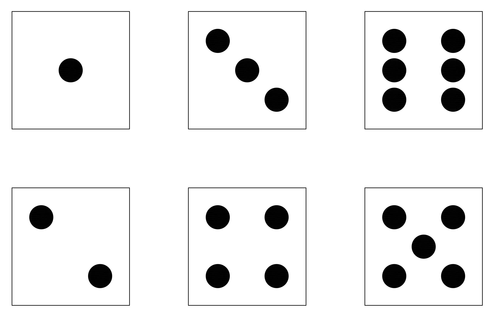
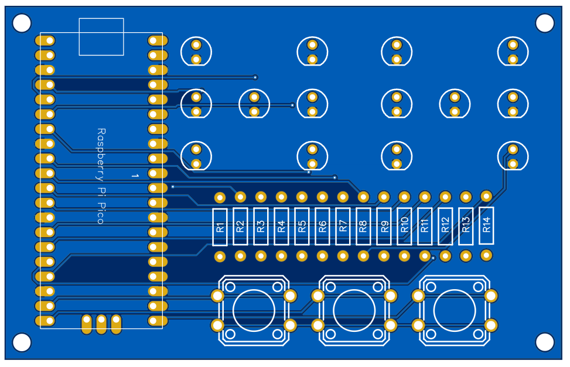
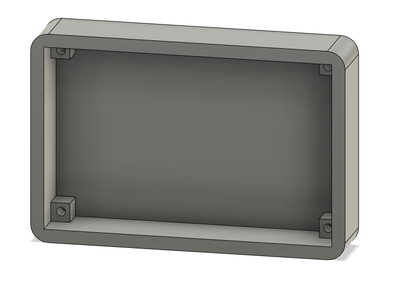

# Raspberry Pi Pico Dice

## Introduction

In this project tutorial, we are going to make a Raspberry Pi Pico Dice. The dice allows you to emulate two dice rolls. It is a fun beginner project for anyone starting out learning the Raspberry Pi Pico.

**Disclaimer** - JLCPCB was generous enough to sponsor this project and provide the PCB used in this project.

## Components + Tools Breakdown

| Components          | Quantity |
| ------------------- | -------- |
| Raspberry Pi Pico W | 1        |
| Custom PCB (JLCPCB) | 1        |
| 5mm LEDs            | 14       |
| 330-1k Ohm Resistor | 14       |
| 3D printed parts    | 1        |
| 3mm screw           | 4        |


| Tools / Equipment       |
| ----------------------- |
| Soldering Iron + Solder |
| Computer + Thonny IDE   |
| Screw driver            |


## Breadboard Prototype

A simple dice was first made on breadboard for testing. The following circuit diagram was used.

<figure><figcaption></figcaption></figure>

We need 7 LEDs to mimic all the possible shapes for a dice pattern as shown in the following figure

<figure><figcaption></figcaption></figure>

We will recreate this patterns later when designing the PCB.&#x20;

### Prototype Code

The code for the breadboard is as follows

```python
from machine import Pin
import utime
import urandom

urandom.seed(utime.ticks_us())

# Define the LED pins for the Dice
dice1_leds = [Pin(i, Pin.OUT) for i in range(0, 7)]


# Define the button pin
button1 = Pin(14, Pin.IN, Pin.PULL_DOWN)


# Define the LED patterns for each number
numbers = [
    [0, 0, 0, 1, 0, 0, 0],  # 1
    [1, 0, 0, 0, 0, 0, 1],  # 2
    [1, 0, 0, 1, 0, 0, 1],  # 3
    [1, 1, 0, 0, 0, 1, 1],  # 4
    [1, 1, 0, 1, 0, 1, 1],  # 5
    [1, 1, 1, 0, 1, 1, 1],  # 6
]

# Function to turn off LEDs of a specific dice
def turn_off_leds(dice_leds):
    for led in dice_leds:
        led.value(0)

# Function to show a number on the dice
def show_number(dice_leds, number):
    # Get the LED pattern for the number
    pattern = numbers[number - 1]
    
    # Loop over each LED in the dice
    for i in range(len(dice_leds)):
        # Get the corresponding LED and its value from the pattern
        led = dice_leds[i]
        value = pattern[i]
        
        # Set the LED to the value from the pattern
        led.value(value)

# Main loop
while True:
    if button1.value() == 1:
        utime.sleep(0.3)  # Wait for 2 seconds to ensure the button is pressed long enough
        if button1.value() == 1:  # Check again if the button is still pressed
            utime.sleep_ms(urandom.randint(0, 200))  # Random delay before generating the number
            show_number(dice1_leds, urandom.randint(1, 6))
            utime.sleep(2)  # Keep the LEDs on for 2 seconds
            turn_off_leds(dice1_leds)  # Then turn them off

    utime.sleep_ms(10)  # Short delay to debounce the button
```

### Code - Breakdown

#### Importing Libraries

```python
machine import Pin
import utime
import urandom

urandom.seed(utime.ticks_us())
```

In these lines, three libraries are imported: `Pin` from `machine`, `utime`, and `urandom`. `Pin` is used to control GPIO pins, `utime` is used for access to time-related functions, and `urandom` is used to generate random numbers. The seed for random numbers is set using the current time in microseconds.

#### Defining LED and Button Pins

```python
# Define the LED pins for the 
Dicedice1_leds = [Pin(i, Pin.OUT) for i in range(0, 7)]
# Define the button 
pinbutton1 = Pin(14, Pin.IN, Pin.PULL_DOWN)
```

Here, LED pins for the dice are set as outputs ranging from 0 to 6. The button pin is set as an input- 14, with a pull-down resistor. This means that when the button is not pressed, the button pin reads as `0` or `False`.

#### Defining LED Number Patterns

```python
# Define the LED patterns for each number
numbers = [
    [0, 0, 0, 1, 0, 0, 0],  # 1
    [1, 0, 0, 0, 0, 0, 1],  # 2
    [1, 0, 0, 1, 0, 0, 1],  # 3
    [1, 1, 0, 0, 0, 1, 1],  # 4
    [1, 1, 0, 1, 0, 1, 1],  # 5
    [1, 1, 1, 0, 1, 1, 1],  # 6
]
```

These lines define the patterns for each number as it would appear on the dice. `0` would turn an LED off, and `1` would turn it on.

#### Functions to Handle LEDs

```python
# Function to turn off LEDs of a specific dice
def turn_off_leds(dice_leds):
    for led in dice_leds:
        led.value(0)
```

This function turns off all the LEDs on the dice by setting their values to 0.

```python
# Function to show a number on the dice
def show_number(dice_leds, number):
    # Get the LED pattern for the number
    pattern = numbers[number - 1]
    
    # Loop over each LED in the dice
    for i in range(len(dice_leds)):
        # Get the corresponding LED and its value from the pattern
        led = dice_leds[i]
        value = pattern[i]
        
        # Set the LED to the value from the pattern
        led.value(value)
```

The `show_number()` function takes in the dice's LED info and a number, then sets the appropriate LEDs on to display that number.

#### Main Loop

```python
# Main loop
while True:
    if button1.value() == 1:
        utime.sleep(0.3)  # Wait for 2 seconds to ensure the button is pressed long enough
        if button1.value() == 1:  # Check again if the button is still pressed
            utime.sleep_ms(urandom.randint(0, 200))  # Random delay before generating the number
            show_number(dice1_leds, urandom.randint(1, 6))
            utime.sleep(2)  # Keep the LEDs on for 5 seconds
            turn_off_leds(dice1_leds)  # Then turn them off

    utime.sleep_ms(10)  # Short delay to debounce the buttons
```

In the main loop, a check is done as to whether the button has been pressed. If yes, a sleep of 0.3 seconds is implemented (to avoid phantom readings), after which it's confirmed if the button is still pressed. If still pressed, a randomly timed delay is executed then the dice number gets displayed using `show_number`. The LEDs stay illuminated for 2 seconds, then get turned off. The button is then debounced with a short delay before the loop repeats.

### PCB ( JLCPCB )

### PCB Design

With a working prototype we can create a custom PCB using EasyEda. The following figure is the schematic diagram for the Pico Dice PCB. Since we have access to 26 GPIO pins on the Pico we can connect all the LEDs to its own GPIO pin and don't require any special drivers to control all the LEDs.

<figure><figcaption></figcaption></figure>

The following figure is the layout of the components on the PCB, which as shown above mimics the patterns of a typical dice.

<figure><figcaption></figcaption></figure>

The PCB was ordered through JLCPCB. They offer great PCBs at a low cost and have promotions and coupons available throughout the year. You can sign up using here, or using the following link:

[https://jlcpcb.com/?from=Nerd](https://jlcpcb.com/?from=NerdCave) that will support me as a creator to keep making content that is accessible and open source at no charge to you.

Ordering the PCB is very simple:

Download the Gerber file [here](https://github.com/Guitarman9119/Raspberry-Pi-Pico-/raw/main/Pico%20Dice/Pico%20Dice%20Gerber.zip).

Click on Add Gerber file

<figure><figcaption></figcaption></figure>

leave all the settings as default given. You might want change the PCB color which you can do here:

<figure><figcaption></figcaption></figure>

Enter you shipping details, save to cart

<figure><figcaption></figcaption></figure>

Then after a few days depending on your location you will receive your great quality PCB.

## Enclosure

The enclosure was designed in Fusion 360.

<figure><figcaption></figcaption></figure>

You can download all the 3D files here: [https://github.com/Guitarman9119/Raspberry-Pi-Pico-/tree/main/Pico%20Dice/3D%20model](https://github.com/Guitarman9119/Raspberry-Pi-Pico-/tree/main/Pico%20Dice/3D%20model)

## Conclusion

This is a simple project, but it a perfect project for beginners that just started out with soldering, coding and 3D modelling.

If you have any questions you can comment on my YouTube video, and while you are on my video consider subscribing to the channel.
