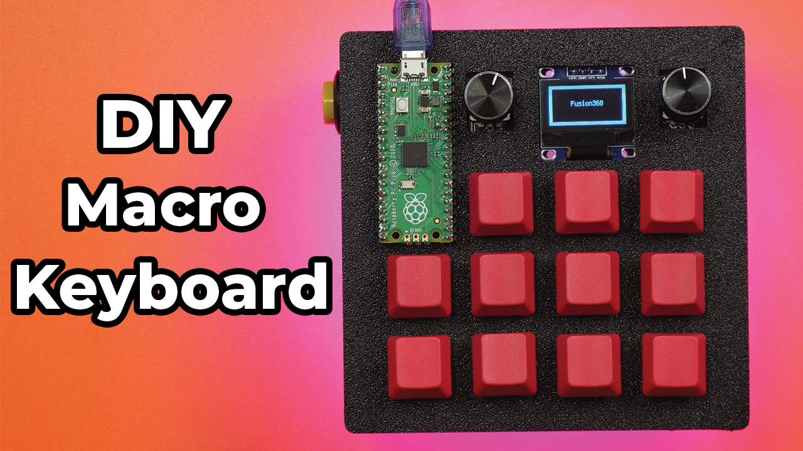
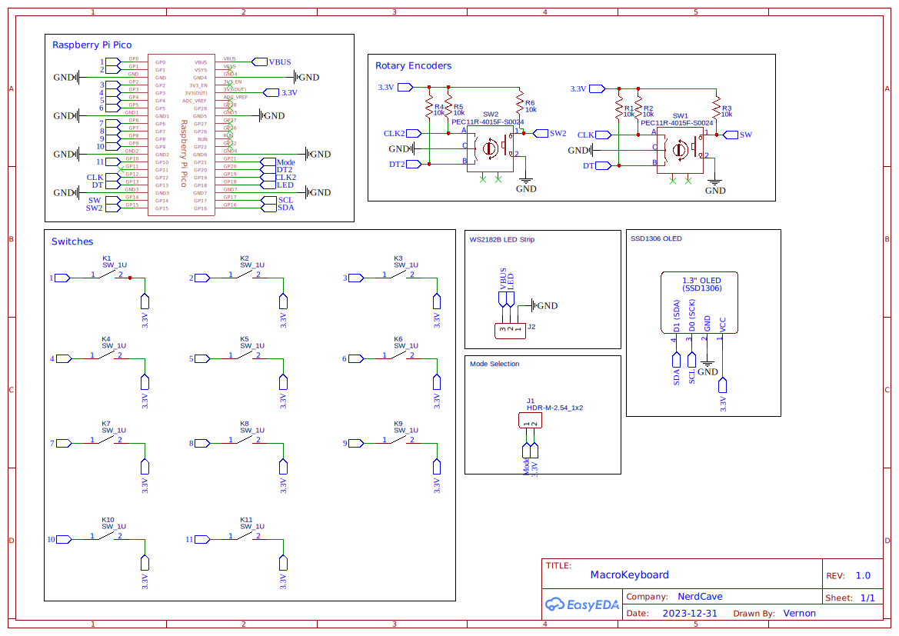
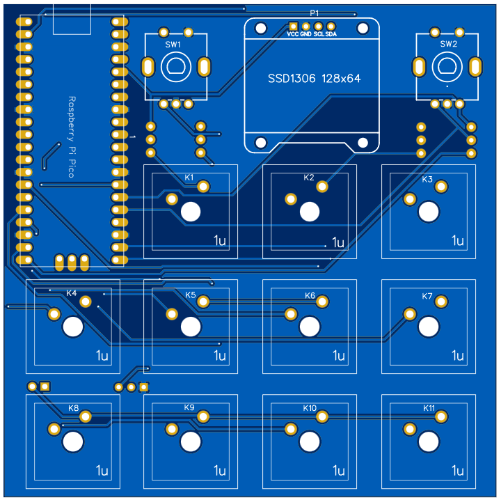
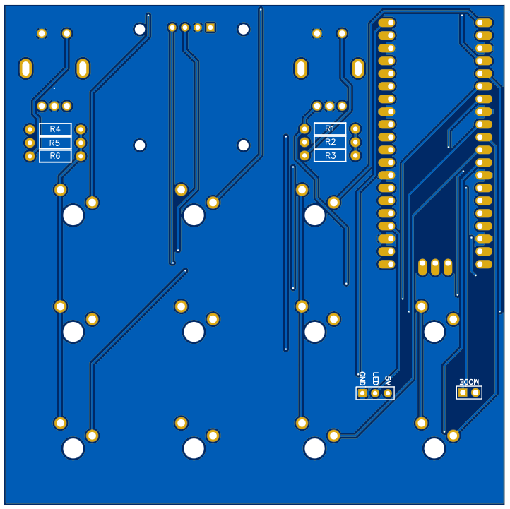
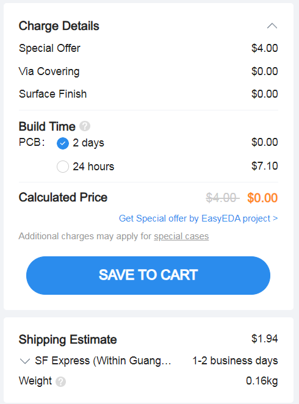
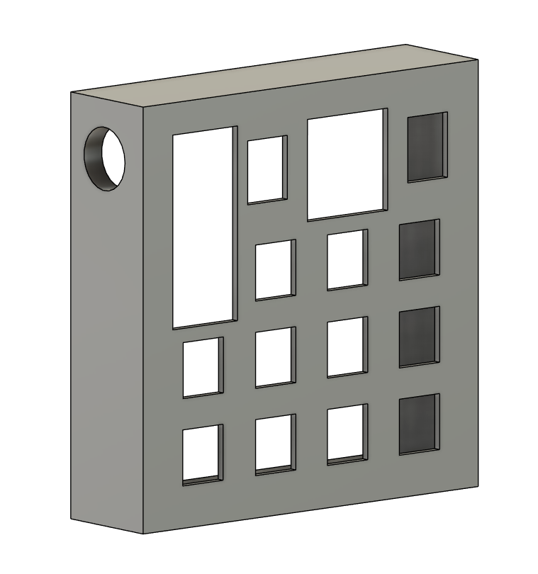
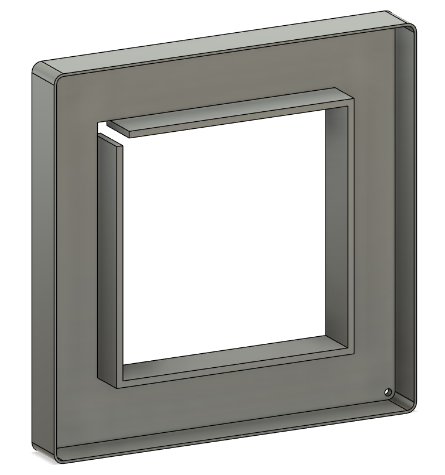

# Pico Macro Keyboard V2

## Introduction

Welcome to this tutorial on creating a mechanical macro keyboard PCB using EasyEDA and Raspberry Pi Pico with Circuit Python.

<figure><figcaption></figcaption></figure>

### What is a macro keyboard?

Macro keyboards are an excellent way to streamline your workflow and increase productivity. With a macro keyboard, you can automate repetitive tasks, execute complex commands with a single key press, and customize your keyboard layout to your needs.

### Cost of this project

Here is the cost breakdown of the project (assuming you have basic tools):

| Components          | Quantity            |
| ------------------- | ------------------- |
| Custom PCB          | 1                   |
| Raspberry Pi Pico   | 1                   |
| Mechanical Switches | 11                  |
| 1.3 OLED I2C        | 1                   |
| Rotary encoder      | 2                   |
| Resistors - 10k     | 6                   |
| 2.54 20 pin Header  | 2                   |
| 2.54 4 pin Header   | 1                   |
| WS2810B LED strip   | 18                  |
| Miscellaneous       | Depending on Design |

## Schematic Diagram

The schematic diagram is available to view here. The design is straightforward as each button was connected to a GPIO pin to the Raspberry Pi Pico. The reason for not using a matrix is due to limited space on a 10 x 10 cm board size, which meant individual GPIO pins could be used. This also means that diodes are not needed to prevent ghosting effect when pressing the keys. The board is kept this dimension to minimize the total cost of the board. The screen can be removed if more buttons are needed, but will require a new PCB design and updated code.


<figure><figcaption></figcaption></figure>

## PCB Design

The PCB design is simple which allows you to mount the PCB easily into different enclosures with the 4 mounting holes in the corners. The placement of the Pico was placed on the bottom layer which will be connected through header pins. If anyone in the community have suggestions on how to improve the layout or want to contribute reach out as I would like to see how this project can be taken further. &#x20;

### PCB Top:

<figure><figcaption></figcaption></figure>

### PCB Bottom:

<figure><figcaption></figcaption></figure>

## PCB ( JLCPCB )

The PCB was ordered through JLCPCB. They offer great PCBs at a low cost and have promotions and coupons available throughout the year. You can sign up using here, or using the following link:

[https://jlcpcb.com/?from=Nerd ](https://jlcpcb.com/?from=Nerd) that will support me as a creator to keep making content that is accesseble and open source at no charge to you.

Ordering the PCB is very simple:

Download the Gerber file in the repository

Sign up through [https://jlcpcb.com/?from=Nerd ](https://jlcpcb.com/?from=Nerd)

Click on Add gerber file

<figure><figcaption></figcaption></figure>

leave all the settings as default given. You might want change the PCB color which you can do here:

<figure><figcaption></figcaption></figure>

Enter you shipping details, save to cart

<figure><figcaption></figcaption></figure>

Then after a few days depending on your location you will receive your great quality PCB.


## Circuit Python

CircuitPython is a variant of the Python programming language designed for microcontrollers, specifically those based on the ARM Cortex-M family of processors. It allows developers to write Python code that can interact with hardware components and sensors, making it a popular choice for DIY electronics projects.

One advantage of using CircuitPython for building a macro keyboard is that it includes the HID (Human Interface Device) library, which allows microcontrollers to act as USB input devices such as keyboards, mice, and gamepads. This means that with CircuitPython, you can program your microcontroller to act like a keyboard and send keystrokes to your computer when a button is pressed on your macro keyboard.

Another advantage of CircuitPython is its ease of use and rapid prototyping capabilities. Since CircuitPython is an interpreted language, developers can write and test code on their computer before uploading it to the microcontroller. Additionally, CircuitPython comes with a large number of built-in libraries and modules that simplify programming for common hardware components, such as OLED displays, sensors, and LED strips. This can save a lot of time and effort compared to writing low-level code in C or assembly language.

### HID Library

In order to get the Raspberry Pi Pico to work as an macro keyboard we need to install a Human Interface Device Library from Adafruit Circuit Python library.

You need to create a folder on your Raspberry Pi Pico named "[adafruit\_hid](https://github.com/Guitarman9119/Raspberry-Pi-Pico-/tree/main/Pico%20Macro%20Keyboard/adafruit\_hid)" and upload the following files in the folder. You can download the files on my GitHub repository. It is also available on Circuit Python website but in order to keep version control for this specific tutorial along with the video I recommend you download it from my GitHub repository.&#x20;

## Code

To follow along with this tutorial make sure you flash the Pico with CircuitPython 7.2.3 which you can download here:

CircuitPython - [https://github.com/Guitarman9119/Raspberry-Pi-Pico-/raw/main/Pico%20MacroKeyboard%20V2/Code.rar](https://github.com/Guitarman9119/Raspberry-Pi-Pico-/raw/main/Pico%20MacroKeyboard%20V2/Code.rar)

All the code can be downloaded here:

Link - [https://github.com/Guitarman9119/Raspberry-Pi-Pico-/raw/main/Pico%20MacroKeyboard%20V2/Code.rar](https://github.com/Guitarman9119/Raspberry-Pi-Pico-/raw/main/Pico%20MacroKeyboard%20V2/Code.rar)

### main.py

This is the main file that will be booted once your power the Pico. Comments is given in the code as detailed as possible and explained below.

```python
import board, busio, displayio, os, terminalio
import adafruit_displayio_ssd1306
from adafruit_display_text import label
import usb_hid
import digitalio
import time
import rotaryio
from adafruit_hid.keycode import Keycode
from adafruit_hid.keyboard import Keyboard
from adafruit_hid.keyboard_layout_us import KeyboardLayoutUS
from adafruit_hid.consumer_control import ConsumerControl
from adafruit_hid.consumer_control_code import ConsumerControlCode

from rainbowio import colorwheel
import neopixel

from blender_mode import handle_keypress as blender_mode_handle_keypress
from windows_mody import handle_keypress as windows_mode_handle_keypress
from premier_mode import handle_keypress as premier_mode_handle_keypress
from aftereffects_mode import handle_keypress as aftereffects_mode_handle_keypress
from fusion360_mode import handle_keypress as fusion360_mode_handle_keypress
from template_mode import handle_keypress as template_mode_handle_keypress

#________________________Neopixel____________________________________________________
pixel_pin = board.GP18
num_pixels = 12

pixels = neopixel.NeoPixel(pixel_pin, num_pixels, brightness=0.3, auto_write=False)

RED = (255, 0, 0)
YELLOW = (255, 150, 0)
GREEN = (0, 255, 0)
CYAN = (0, 255, 255)
BLUE = (0, 0, 255)
PURPLE = (180, 0, 255)

def color_chase(color, wait):
    for i in range(num_pixels):
        pixels[i] = color
        time.sleep(wait)
        pixels.show()
    time.sleep(0.5)

def rainbow_cycle(wait):
    for j in range(255):
        for i in range(num_pixels):
            rc_index = (i * 256 // num_pixels) + j
            pixels[i] = colorwheel(rc_index & 255)
        pixels.show()
        time.sleep(wait)
      
#____________________________________________________________________________________
# Set up Consumer Control - Control Codes can be found here: https://docs.circuitpython.org/projects/hid/en/latest/_modules/adafruit_hid/consumer_control_code.html#ConsumerControlCode
cc = ConsumerControl(usb_hid.devices)

# Set up a keyboard device. - Keycode can be found here: https://docs.circuitpython.org/projects/hid/en/latest/_modules/adafruit_hid/keycode.html#Keycode
keyboard = Keyboard(usb_hid.devices)

# Set up keyboard to write strings from macro
write_text = KeyboardLayoutUS(keyboard)

displayio.release_displays()

sda, scl = board.GP16, board.GP17  
i2c = busio.I2C(scl, sda)
display_bus = displayio.I2CDisplay(i2c, device_address=0x3C)
print(display_bus)
display = adafruit_displayio_ssd1306.SSD1306(display_bus, width=128, height=64)

# Make the display context
splash = displayio.Group()
display.show(splash)

color_bitmap = displayio.Bitmap(128, 64, 1)
color_palette = displayio.Palette(1)
color_palette[0] = 0xFFFFFF  # White

bg_sprite = displayio.TileGrid(color_bitmap, pixel_shader=color_palette, x=0, y=0)
splash.append(bg_sprite)

# Draw a smaller inner rectangle
inner_bitmap = displayio.Bitmap(118, 54, 1)
inner_palette = displayio.Palette(1)
inner_palette[0] = 0x000000  # Black
inner_sprite = displayio.TileGrid(inner_bitmap, pixel_shader=inner_palette, x=5, y=5)
splash.append(inner_sprite)

# Draw a label
text = "NerdCave!"
text_area = label.Label(terminalio.FONT, text=text, color=0xFFFF00, x=35, y=28)
splash.append(text_area)

# Draw a label
text2 = "MacroKeyboard"
text_area2 = label.Label(terminalio.FONT, text=text2, color=0xFFFF00, x=26, y=40)
splash.append(text_area2)


# These are the corresponding GPIOs on the Pi Pico that is used for the Keys on the PCB

buttons = [board.GP0,board.GP1,board.GP2,board.GP3,board.GP4,board.GP5,board.GP6,board.GP7,board.GP8,board.GP9,board.GP10,board.GP11]
key = [digitalio.DigitalInOut(pin_name) for pin_name in buttons]
for x in range(0,len(buttons)):
    key[x].direction = digitalio.Direction.INPUT
    key[x].pull = digitalio.Pull.DOWN

modeChangeButton = digitalio.DigitalInOut(board.GP21)
modeChangeButton.direction = digitalio.Direction.INPUT
modeChangeButton.pull = digitalio.Pull.DOWN

#___________________Setup Rotary Encoder____________________________
DT_Pin1 = digitalio.DigitalInOut(board.GP12)
DT_Pin1.direction = digitalio.Direction.INPUT
DT_Pin1.pull = digitalio.Pull.DOWN

CLK_Pin1 = digitalio.DigitalInOut(board.GP13)
CLK_Pin1.direction = digitalio.Direction.INPUT
CLK_Pin1.pull = digitalio.Pull.DOWN


SW1 = digitalio.DigitalInOut(board.GP14)
SW1.direction = digitalio.Direction.INPUT
SW1.pull = digitalio.Pull.DOWN

DT_Pin2 = digitalio.DigitalInOut(board.GP19)
DT_Pin2.direction = digitalio.Direction.INPUT
DT_Pin2.pull = digitalio.Pull.DOWN

CLK_Pin2 = digitalio.DigitalInOut(board.GP20)
CLK_Pin2.direction = digitalio.Direction.INPUT
CLK_Pin2.pull = digitalio.Pull.DOWN


SW2 = digitalio.DigitalInOut(board.GP15)
SW2.direction = digitalio.Direction.INPUT
SW2.pull = digitalio.Pull.DOWN

#___________________Rotary Encoder Function______________________

previousValue = 1
previousValue2 = 1

def rotary_changed_left():
    global previousValue
    if previousValue != CLK_Pin1.value:
        if CLK_Pin1.value == 0:
            if DT_Pin1.value == 0:
                return(False)
            else:   
                return(True)     
        previousValue = CLK_Pin1.value
    return(None)
        
def rotary_changed_right():
    global previousValue2
    if previousValue2 != CLK_Pin2.value:
        if CLK_Pin2.value == 0:
            if DT_Pin2.value == 0:
                return(False)
            else:
                return(True)
        previousValue2 = CLK_Pin2.value
    return(None)
    
#__________________________________________________________________________________________
#_________________List of defind mode names, change the modes as you need_________________

mode_names = {1 : 'Blender', 2 : 'Windows', 3 : 'Premier Pro', 4 : "After Effects", 5 : "Fusion360" ,6: "Template"}

# Set Default Mode To 1
mode = 0
        
print(mode_names[1])        

# Function to update the macro label on the OLED screen
def update_macro_label(macro_name):
    macro_label = label.Label(terminalio.FONT, text=macro_name, color=0xFFFF00, x=0, y=55)
    splash.append(macro_label)
    display.refresh()
    time.sleep(3)
    splash.remove(macro_label)
    display.refresh()


while True:

    if modeChangeButton.value:
        mode = mode + 1
        if mode > 6:
            mode = 1
        time.sleep(1)
        
        # Make the display context
        splash = displayio.Group()
        display.show(splash)

        color_bitmap = displayio.Bitmap(128, 64, 1)
        color_palette = displayio.Palette(1)
        color_palette[0] = 0xFFFFFF  # White

        bg_sprite = displayio.TileGrid(color_bitmap, pixel_shader=color_palette, x=0, y=0)
        splash.append(bg_sprite)

        # Draw a smaller inner rectangle
        inner_bitmap = displayio.Bitmap(118, 54, 1)
        inner_palette = displayio.Palette(1)
        inner_palette[0] = 0x000000  # Black
        inner_sprite = displayio.TileGrid(inner_bitmap, pixel_shader=inner_palette, x=5, y=5)
        splash.append(inner_sprite)

        # Draw a label
        text = mode_names[mode]
        center_x = (118 - len(text) * 6) // 2 + 5
        text_area = label.Label(terminalio.FONT, text=text, color=0xFFFF00, x=center_x, y=28)
        splash.append(text_area)
    
#----------------------------------------MODE 1--------------------------------------------------------------------------
        
    if mode == 0:
        rainbow_cycle(0)
        time.sleep(0.01)
        
    
    if mode == 1:
        blender_mode_handle_keypress(key, cc, write_text, keyboard, SW1, SW2, rotary_changed_left, rotary_changed_right, splash, display)
        pixels.fill(GREEN)
        pixels.show()

        
    elif mode == 2:
        windows_mode_handle_keypress(key, cc, write_text, keyboard, SW1, SW2, rotary_changed_left, rotary_changed_right, splash, display)
        pixels.fill(YELLOW)
        pixels.show()
        
    elif mode == 3:
        premier_mode_handle_keypress(key, cc, write_text, keyboard, SW1, SW2, rotary_changed_left, rotary_changed_right, splash, display)
        pixels.fill(RED)
        pixels.show()

    elif mode == 4:
        aftereffects_mode_handle_keypress(key, cc, write_text, keyboard, SW1, SW2, rotary_changed_left, rotary_changed_right, splash, display)
        pixels.fill(CYAN)
        pixels.show()
        
    elif mode == 5:
        fusion360_mode_handle_keypress(key, cc, write_text, keyboard, SW1, SW2, rotary_changed_left, rotary_changed_right, splash, display)
        pixels.fill(PURPLE)
        pixels.show()
        
    elif mode == 6:
        template_mode_handle_keypress(key, cc, write_text, keyboard, SW1, SW2, rotary_changed_left, rotary_changed_right, splash, display)
        pixels.fill(CYAN)
        pixels.show()
          

    time.sleep(0.001)
```

To create your own macro for a specific software you need to follow the following process.

**Part 1: Creating the Custom Mode File** To begin, we'll create a new Python file for our custom mode. Let's name it `my_custom_mode.py`. Inside this file, we'll define a function called `handle_keypress` to handle the keypresses and execute macros specific to our custom mode. Here's an example of how `my_custom_mode.py` might look:

```python
import time
import board, busio, displayio, os, terminalio
import digitalio
import time
from adafruit_hid.keycode import Keycode
from adafruit_hid.consumer_control_code import ConsumerControlCode
from adafruit_display_text import label
import adafruit_displayio_ssd1306

def update_screen(splash, macro_name, display):
    # Update the macro label
    center_x = (118 - len(macro_name) * 6) // 2 + 5
    macro_label = label.Label(terminalio.FONT, text=macro_name, color=0xFFFF00, x=center_x, y=50)
    splash.append(macro_label)
    display.refresh()
    # Wait for 1 seconds
    time.sleep(1)
    # Remove the macro label after 1 seconds
    splash.remove(macro_label)
    display.refresh()
    
def handle_keypress(key, cc, write_text, keyboard, SW1, SW2, rotary_changed_left, rotary_changed_right, splash, display ):
    
    # Macro names or actions
    # Change the macro names * 
    macro_names = {
        0: "*",
        1: "*",
        2: "*",
        3: "*",
        4: "*",
        5: "*",
        6: "*",
        7: "*",
        8: "*",
        9: "*",
        10: "*",
        11: "*",
        # Add more macro names and their corresponding keys as needed
    }
    
    #Repkace keyboard.send(Keycode.G) with your macro code
    
    if key[0].value:
        keyboard.send(Keycode.G)
        time.sleep(0.2)
        update_screen(splash, macro_names[0], display)
         
    if key[1].value:
        keyboard.send(Keycode.G)
        time.sleep(0.2)
        update_screen(splash, macro_names[1], display)
        
    if key[2].value:
        keyboard.send(Keycode.G)
        time.sleep(0.2)
        update_screen(splash, macro_names[2], display)
    
    if key[3].value:
        cc.send(ConsumerControlCode.VOLUME_INCREMENT)
        time.sleep(0.2)
        update_screen(splash, macro_names[3], display)
    
    if key[4].value:
        keyboard.send(Keycode.G)
        time.sleep(0.3)
        update_screen(splash, macro_names[4], display)
        
    if key[5].value:
        keyboard.send(Keycode.G)
        time.sleep(0.3)
        update_screen(splash, macro_names[5], display)

    if key[6].value:
        keyboard.send(Keycode.G)
        time.sleep(0.3)
        update_screen(splash, macro_names[6], display)
        
    if key[7].value:
        keyboard.send(Keycode.G)
        time.sleep(0.3)
        update_screen(splash, macro_names[7], display)
        
    if key[8].value:
        keyboard.send(Keycode.G)
        time.sleep(0.3)
        update_screen(splash, macro_names[8], display)
        
        
    if key[9].value:
        keyboard.send(Keycode.G)
        time.sleep(0.3)
        update_screen(splash, macro_names[9], display)
        
    if key[10].value:
        keyboard.send(Keycode.G)
        time.sleep(0.3)
        update_screen(splash, macro_names[10], display)
        
    if key[11].value:
        keyboard.send(Keycode.G)
        time.sleep(0.3)
        update_screen(splash, macro_names[10], display)
        
    #Rotary encoder 1 turned clockwise     
    if rotary_changed_left() == True:
        cc.send(ConsumerControlCode.VOLUME_INCREMENT)
        time.sleep(0.01)
        
    elif rotary_changed_left() == False:
        cc.send(ConsumerControlCode.VOLUME_DECREMENT)
        time.sleep(0.01)
    
    
    #Rotary encoder 2 turned clockwise
    if rotary_changed_right() == True:
        cc.send(ConsumerControlCode.VOLUME_INCREMENT)
        time.sleep(0.01)
         
    elif rotary_changed_right() == False:
        cc.send(ConsumerControlCode.VOLUME_DECREMENT)
        time.sleep(0.01)
            
    if not SW1.value:
        keyboard.send(Keycode.G)
        time.sleep(0.2)
        
    if not SW2.value:
        keyboard.send(Keycode.G)
        time.sleep(0.2)

    time.sleep(0.0001)
```

Now that we have our custom mode defined in `my_custom_mode.py`, let's import it into the `code.py` script to make it an integral part of our macro keyboard. Here's how you can import the custom mode:

```python
# code.py

# Import the custom mode
from my_custom_mode import handle_keypress as my_custom_mode_handle_keypress
```

**Adding the Custom Mode to mode\_names Dictionary** For better user experience, we should add our custom mode name to the `mode_names` dictionary so that it appears on the OLED display. Let's update the dictionary in the `code.py` script:

```
# code.py

# List of predefined modes and their associated functions
mode_names = {1: 'Blender', 2: 'Windows', 3: 'Premier Pro', 4: "After Effects", 5: "Fusion360", 6: "My Custom Mode"}


```

Congratulations! You've successfully added a custom mode to your Raspberry Pi Pico Macro Keyboard. With this new mode, you can now unleash a whole new world of possibilities and personalize your macro keyboard to suit your unique needs.

Feel free to experiment and create custom macros that cater to your workflow and preferences. Whether it's for productivity, entertainment, or anything in between, your custom mode will make your macro keyboard truly one-of-a-kind.

## Enclosure Design

The enclosure was made in Fusion360. The enclosure consist of two part the main body and bottom part which is used to diffuse the LEDs


<figure><figcaption></figcaption></figure>

<figure><figcaption></figcaption></figure>


The parts does not require any supports when printing.&#x20;

If anyone decides to recreate this project and comes up with an improved design for the case, please feel free to share it with me. I would love to see what you create!

## Conclusion

The software can still be improved. I am looking at adding a joystick in V3 so make sure to subscribe to my YouTube channel for an update
