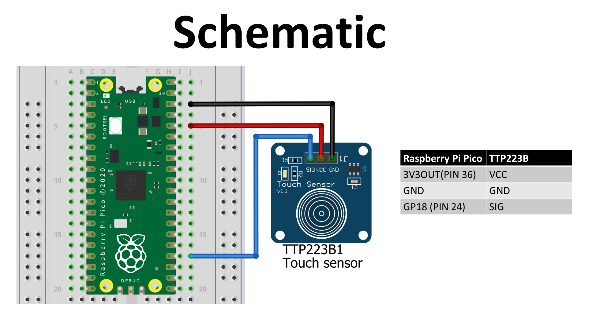

# TTP223 Capacitive Touch Sensor Module 

In this tutorial, we will look at this Capacitive Touch Sensor. These capacitive touch sensor modules based on the TTP223 IC are the most accessible and inexpensive ways to get touch sensing in your projects. We will connect this to the Raspberry Pi Pico and do a simple example of turning an LED on and off using the sensor.

## What are touch switches?
A touch switch, is one of the many available types of switches that need physical contact from a person to work. Touch switch will only actuate when there is direct physical contact or some degree of change in dielectric constant of the circuit.

## Components Required

To follow along with this tutorial, you will need the following components:
-   Raspberry Pi Pico
-   TTP223 capacitive touch sensor module
-   Breadboard and 3 Female-to-Male jumper wires

## Schematic Diagram
Build your circuit according to the following schematic:

## Code
    from machine import Pin
    import time

    Touch_pad = machine.Pin(18,Pin.IN,Pin.PULL_UP)

    led = Pin(25,Pin.OUT)

    while True:

        if Touch_pad.value()==1:
            print("Touched")
            led.toggle()
            time.sleep(0.5)

