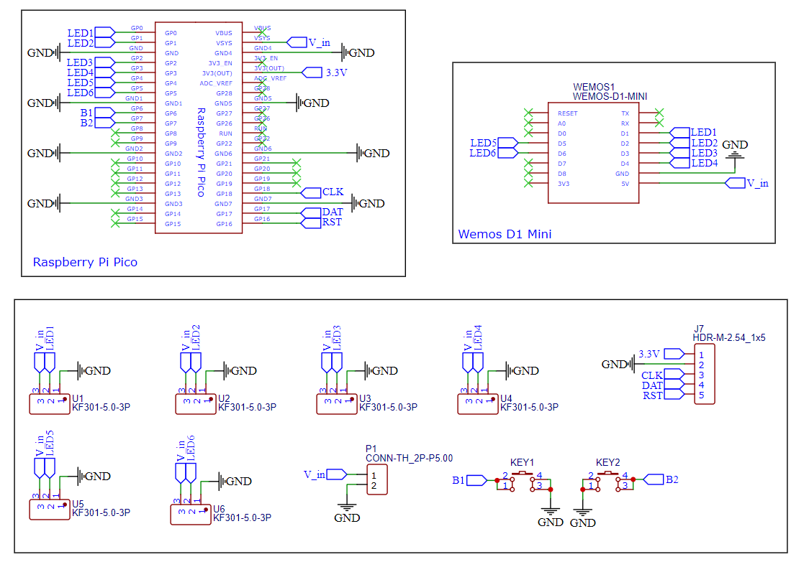
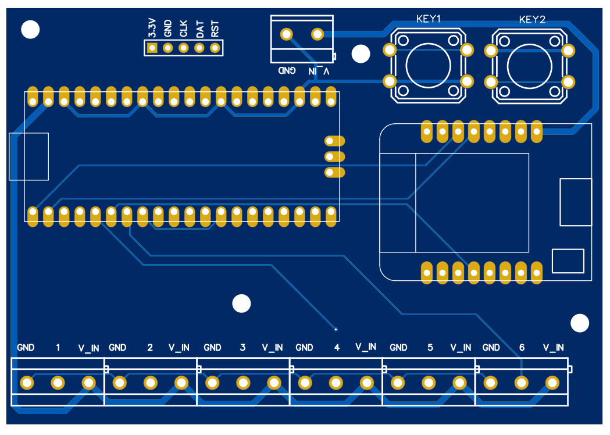

# WS2812B LED Controller

WS2812B LED Controller based on the **Raspberry Pi Pico / Pico W** and **ESP8266 D1 Mini**.

This project demonstrates how to design and build a **custom through-hole PCB** that simplifies controlling WS2812B addressable LEDs. You can choose between:

- **Raspberry Pi Pico / Pico W** using MicroPython + NeoPixel  
- **ESP8266 D1 Mini** using **WLED firmware**

Perfect for desk lighting, classroom projects, IoT builds, or creative LED installations.

---

## 📺 YouTube Video

---

## 📖 Introduction

Welcome to this tutorial on creating a **custom PCB controller for WS2812B LEDs** using either the Raspberry Pi Pico or the D1 Mini.

This PCB simplifies the process of controlling addressable LEDs by supporting:

- **NeoPixel library** (Raspberry Pi Pico / Pico W)
- **WLED firmware** (ESP8266 D1 Mini)

Whether you're enhancing ambient lighting, learning MicroPython, or building classroom kits, this guide walks you through **PCB design, ordering, assembly, and code**.

---

## 🧰 Components – Breakdown

| Component | Quantity |
|---------|---------|
| Custom PCB | 1 |
| Raspberry Pi Pico / Pico W | 1 |
| ESP8266 D1 Mini | 1 |
| 12×12 mm Push Buttons | 2 |
| 2.54 mm 20-Pin Header | 2 |
| 2-Pin Screw Terminals (2.54 mm pitch) | 7 |
| Miscellaneous | As needed |

---

## 📐 Schematic Diagram

The schematic was created using **EasyEDA**.  
All components are **through-hole**, making this project beginner-friendly and mechanically robust.

---

## 🧩 PCB Design

The PCB was designed in **EasyEDA**, a free web-based EDA tool.

### Key Features

- Two Push Buttons  
- Bluetooth Header (HC-05)  
- Four 3 mm Mounting Holes  

---

# 🛒 Ordering the PCB (JLCPCB)

To manufacture the PCB for this project, we’ll use **JLCPCB**, a reliable and affordable PCB manufacturer that’s great for both hobbyists and educators.

If you don’t already have an account, you can sign up using the link below.  
Using this link helps support my content and keeps these projects open-source:

🔗 https://jlcpcb.com/?from=NerdCave

---

### Step 1: Download the Gerber Files

PCB manufacturers don’t use schematic files directly — they require **Gerber files**, which describe each layer of the PCB.

Download the Gerber files from the GitHub repository here:

👉 https://github.com/Guitarman9119/Raspberry-Pi-Pico-/tree/main/WS2812B%20Controller

Make sure you download the **entire Gerber ZIP file** and **do not unzip it**.

---

### Step 2: Upload Gerber Files to JLCPCB

1. Go to https://jlcpcb.com
2. Click **“Order Now”** or **“Add Gerber File”**
3. Upload the Gerber `.zip` file you downloaded

Once uploaded, JLCPCB will automatically analyze the PCB and generate a preview.

This preview allows you to:
- Confirm the board shape
- Check mounting holes
- Verify text and silkscreen placement

---

### Step 3: PCB Settings (Important)

For this project, **you can safely leave all settings as default**, which is ideal for beginners.

Recommended defaults:
- **Layers:** 2
- **Thickness:** 1.6 mm
- **Copper Weight:** 1 oz
- **Surface Finish:** HASL (Lead-Free)
- **Quantity:** 5 (minimum order)

Optional customization:
- 🎨 **PCB Color** – Choose any color you like (green, black, blue, purple, etc.)
- 🏷️ **Silkscreen Color** – Usually white works best

> 💡 Tip: Dark PCB colors look great, but white silkscreen offers the best readability.

---

### Step 4: Shipping & Checkout

1. Enter your **shipping address**
2. Choose a **shipping method**
   - DHL / FedEx → faster, more expensive
   - Economy shipping → slower but cheaper
3. Review the order summary
4. Complete payment

JLCPCB frequently offers **discount coupons**, so your first few boards are often extremely cheap.

---

### Step 5: Manufacturing & Delivery

After checkout:
- PCB fabrication usually takes **1–2 days**
- Shipping time depends on your location (typically 3–10 days)

Once delivered, you’ll receive:
- Professionally manufactured PCBs
- Clean silkscreen
- Accurate drill holes
- Excellent solder mask quality

Your board is now ready for **through-hole soldering** and assembly.

---

### Why JLCPCB?

- ✅ Very low cost (perfect for classrooms and kits)
- ✅ Excellent quality
- ✅ Fast turnaround
- ✅ Beginner-friendly ordering process

This makes JLCPCB ideal for:
- Student projects
- Open-source hardware
- YouTube / maker tutorials
- Small production runs

---

If this is your **first PCB order**, don’t worry — the process is much easier than it looks, and this project is designed to be forgiving and beginner-friendly.

## 💻 Code – Raspberry Pi Pico (MicroPython)

See `main.py` and `neopixel.py` in this repository.

---

## ✅ Conclusion

This project provides a flexible and beginner-friendly way to control WS2812B LEDs using either MicroPython or WLED.

Happy building! 🚀
