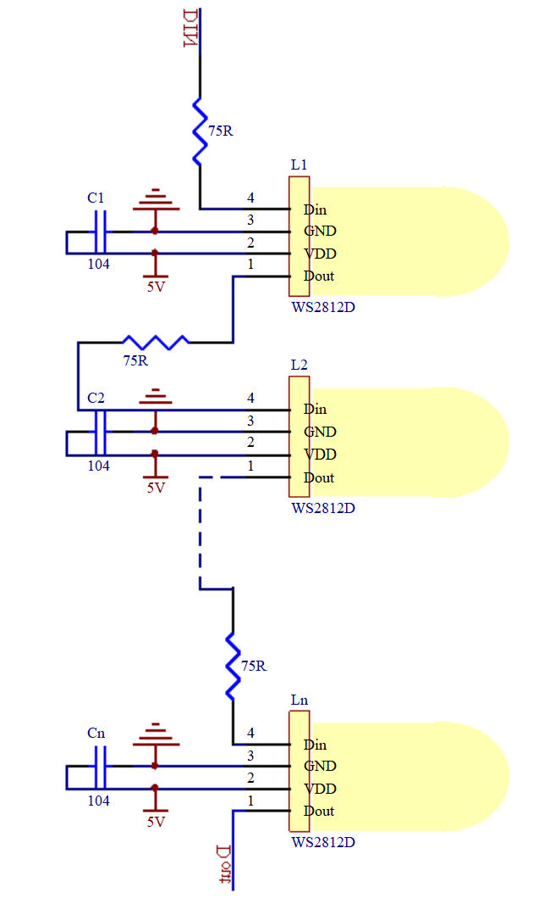
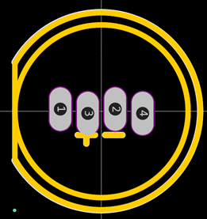
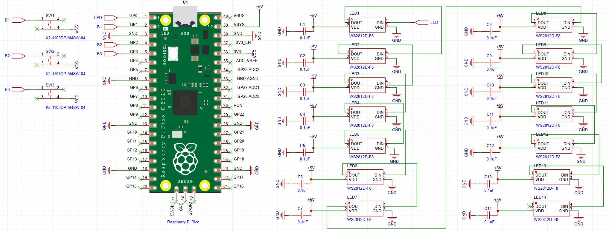

# Raspberry Pi Pico WS2812B Dice

### YouTube Video
<iframe width="728" height="410" src="https://www.youtube.com/embed/xxxxxxxxxxxx" title="YouTube video player" frameborder="10" allow="accelerometer; autoplay; clipboard-write; encrypted-media; gyroscope; picture-in-picture; web-share" allowfullscreen></iframe>


## Introduction

In this project, we are recreating a previous Raspberry Pi Pico Dice build using WS2812B through-hole LEDs. With three push buttons, you can roll either the left die, the right die, or both dice together using the middle button.
The PCB design for this project will to mimic the face patterns of a standard die shown below.

<figure><figcaption></figcaption></figure>

**Disclaimer** - JLCPCB was generous enough to sponsor this project and provide the PCB used in this project.

## Components + Tools Breakdown

| Components          | Quantity            |
| ------------------- | ------------------- |
| Custom PCB (JLCPB) | 1 |
| Raspberry Pi Pico  | 1 |
| WS2812B 8mm THT    | 14 |
| 2.54 20 pin Header | 2 |
| 12x12 PCB mount buttons | 3 |
| 3D printed enclosure | 1 |

<table><thead><tr><th>Tools / Equipment</th><th data-hidden></th></tr></thead><tbody><tr><td>Soldering Iron + Solder</td><td></td></tr><tr><td>Computer + Thonny IDE</td><td></td></tr><tr><td>Screw driver</td><td></td></tr></tr><tr><td>3D printer</td><td></td></tr></tbody></table>


## WS2812B 8mm

I purchased the LEDs online from Taobao and discovered that their pinout was different from the commonly available part. To fix this, I edited the footprint in EasyEDA to match the LEDs I received. For easier soldering, I also changed the pads to oval shapes and slightly staggered the pins.

<figure><figcaption></figcaption></figure>

This is the edited part in EasyEDA. The Din and Dout pins were swapped.

<figure class="text-center">
  
  <figcaption></figcaption>
</figure>


## PCB ( JLCPCB )

### PCB Design

Once the prototype was working, I designed a custom PCB in EasyEDA.  
The schematic for the Pico Dice PCB is shown below:

<figure><figcaption></figcaption></figure>

Here is the PCB layout. As shown, the LEDs are arranged to mimic the face patterns of a standard die.

<figure><figcaption></figcaption></figure>

The PCB was manufactured by JLCPCB, who offer high-quality boards at low cost, often with discounts and coupons available throughout the year. You can support me as a creator by signing up using this link:

[https://jlcpcb.com/?from=Nerd](https://jlcpcb.com/?from=NerdCave) that will support me as a creator to keep making content that is accessible and open source at no charge to you.

Ordering the PCB is very simple:

Download the Gerber file [here](https://github.com/Guitarman9119/Raspberry-Pi-Pico-/raw/main/Pico%20Dice/Pico%20Dice%20Gerber.zip).

Click on Add Gerber file

<figure><figcaption></figcaption></figure>

Leave all the settings as default. You may change the PCB color here:

<figure><figcaption></figcaption></figure>

Enter your shipping details, save to cart

<figure><figcaption></figcaption></figure>

Then after a few days depending on your location you will receive your PCB.

### Final Code

```python
from machine import Pin
import utime
import urandom

urandom.seed(utime.ticks_us())


# Define the LED pins for the two dice
dice1_leds = [Pin(i, Pin.OUT) for i in range(0, 7)]
dice2_leds = [Pin(i, Pin.OUT) for i in range(7, 14)]

# Define the button pins
button1 = Pin(14, Pin.IN, Pin.PULL_DOWN)
button2 = Pin(15, Pin.IN, Pin.PULL_DOWN)
button3 = Pin(16, Pin.IN, Pin.PULL_DOWN)

# Define the LED patterns for each number
numbers = [
    [0, 0, 0, 1, 0, 0, 0],  # 1
    [1, 0, 0, 0, 0, 0, 1],  # 2
    [1, 0, 0, 1, 0, 0, 1],  # 3
    [1, 1, 0, 0, 0, 1, 1],  # 4
    [1, 1, 0, 1, 0, 1, 1],  # 5
    [1, 1, 1, 0, 1, 1, 1],  # 6
]

# Function to turn off LEDs of a specific dice
def turn_off_leds(dice_leds):
    for led in dice_leds:
        led.value(0)

# Function to show a number on the dice
def show_number(dice_leds, number):
    # Get the LED pattern for the number
    pattern = numbers[number - 1]
    
    # Loop over each LED in the dice
    for i in range(len(dice_leds)):
        # Get the corresponding LED and its value from the pattern
        led = dice_leds[i]
        value = pattern[i]
        
        # Set the LED to the value from the pattern
        led.value(value)

# Main loop
while True:
    if button1.value() == 1:
        utime.sleep(0.3)  # Wait for 2 seconds to ensure the button is pressed long enough
        if button1.value() == 1:  # Check again if the button is still pressed
            utime.sleep_ms(urandom.randint(0, 200))  # Random delay before generating the number
            show_number(dice1_leds, urandom.randint(1, 6))
            utime.sleep(2)  # Keep the LEDs on for 5 seconds
            turn_off_leds(dice1_leds)  # Then turn them off
    elif button2.value() == 1:
        utime.sleep(0.3)
        if button2.value() == 1:
            utime.sleep_ms(urandom.randint(0, 200))  # Random delay before generating the number
            dice1_number = urandom.randint(1, 6)
            dice2_number = urandom.randint(1, 6)
            show_number(dice1_leds, dice1_number)
            show_number(dice2_leds, dice2_number)
            utime.sleep(3)  # Keep the LEDs on for 5 seconds
            turn_off_leds(dice1_leds)  # Then turn them off
            turn_off_leds(dice2_leds)  # Then turn them off
    elif button3.value() == 1:
        utime.sleep(0.3)
        if button3.value() == 1:
            utime.sleep_ms(urandom.randint(0, 200))  # Random delay before generating the number
            show_number(dice2_leds, urandom.randint(1, 6))
            utime.sleep(2)  # Keep the LEDs on for 5 seconds
            turn_off_leds(dice2_leds)  # Then turn them off
    utime.sleep_ms(10)  # Short delay to debounce the buttons


```

## Enclosure

The enclosure was designed in Fusion 360.

<figure><figcaption></figcaption></figure>

You can download all the 3D files here: [https://github.com/Guitarman9119/Raspberry-Pi-Pico-/tree/main/Pico%20Dice/3D%20model](https://github.com/Guitarman9119/Raspberry-Pi-Pico-/tree/main/Pico%20Dice/3D%20model)

## Conclusion

This is a simple but fun project, and it makes a great introduction for beginners learning soldering, coding, and 3D modeling.

If you have any questions, feel free to leave a comment on my YouTube video. And while you’re there, consider subscribing to the channel to support more open-source projects like this one.


