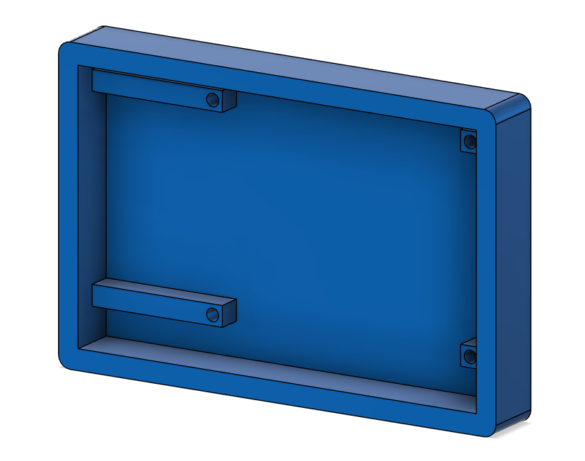

# Raspberry Pi Pico WS2812B Dice

### YouTube Video


## Introduction

In this project, we are recreating a previous Raspberry Pi Pico Dice build using WS2812B through-hole LEDs. With three push buttons, you can roll either the left die, the right die, or both dice together using the middle button.
The PCB design for this project will to mimic the face patterns of a standard die shown below.

<figure><figcaption></figcaption></figure>

**Disclaimer** - JLCPCB was generous enough to sponsor this project and provide the PCB used in this project.

## Components + Tools Breakdown

| Components          | Quantity            |
| ------------------- | ------------------- |
| Custom PCB (JLCPB) | 1 |
| Raspberry Pi Pico  | 1 |
| WS2812B 8mm THT    | 14 |
| 2.54 20 pin Header | 2 |
| 12x12 PCB mount buttons | 3 |
| 3D printed enclosure | 1 |

<table><thead><tr><th>Tools / Equipment</th><th data-hidden></th></tr></thead><tbody><tr><td>Soldering Iron + Solder</td><td></td></tr><tr><td>Computer + Thonny IDE</td><td></td></tr><tr><td>Screw driver</td><td></td></tr></tr><tr><td>3D printer</td><td></td></tr></tbody></table>


## WS2812B 8mm

I purchased the LEDs online from Taobao and discovered that their pinout was different from the commonly available part. To fix this, I edited the footprint in EasyEDA to match the LEDs I received. For easier soldering, I also changed the pads to oval shapes and slightly staggered the pins.

<figure><figcaption></figcaption></figure>

This is the edited part in EasyEDA. The Din and Dout pins were swapped.

<figure class="text-center">
  
  <figcaption></figcaption>
</figure>


## PCB ( JLCPCB )

### PCB Design

Once the prototype was working, I designed a custom PCB in EasyEDA.  
The schematic for the Pico Dice PCB is shown below:

<figure><figcaption></figcaption></figure>

Here is the PCB layout. As shown, the LEDs are arranged to mimic the face patterns of a standard die.

<figure><figcaption></figcaption></figure>

The PCB was manufactured by JLCPCB, who offer high-quality boards at low cost, often with discounts and coupons available throughout the year. You can support me as a creator by signing up using this link:

[https://jlcpcb.com/?from=Nerd](https://jlcpcb.com/?from=NerdCave) that will support me as a creator to keep making content that is accessible and open source at no charge to you.

Ordering the PCB is very simple:

Download the Gerber file [here](https://github.com/Guitarman9119/Raspberry-Pi-Pico-/raw/refs/heads/main/WS2812B%20Dice/WS2812b%20Dice.zip).

Click on Add Gerber file

<figure><figcaption></figcaption></figure>

Leave all the settings as default. You may change the PCB color here:

<figure><figcaption></figcaption></figure>

Enter your shipping details, save to cart

<figure><figcaption></figcaption></figure>

Then after a few days depending on your location you will receive your PCB.

### Final Code

```python
from machine import Pin
import utime
import urandom
from neopixel import Neopixel

urandom.seed(utime.ticks_us())

# ============================
# NeoPixel Setup
# ============================
NUM_LEDS = 14
PIN_NUM = 0
STATE_MACHINE = 0

np = Neopixel(NUM_LEDS, STATE_MACHINE, PIN_NUM, "GRB")
np.brightness(80)  # 1–255

# Dice layout
DICE_LEN = 7
DICE1_START = 0
DICE2_START = 7

OFF = (0, 0, 0)

# ============================
# Buttons (Pico: GP1/2/3)
# ============================
button1 = Pin(1, Pin.IN, Pin.PULL_DOWN)  # roll dice 1
button2 = Pin(2, Pin.IN, Pin.PULL_DOWN)  # roll both
button3 = Pin(3, Pin.IN, Pin.PULL_DOWN)  # roll dice 2

# Dice pip patterns for 1–6 (7 LEDs per die)
numbers = [
    [0, 0, 0, 1, 0, 0, 0],  # 1
    [1, 0, 0, 0, 0, 0, 1],  # 2
    [1, 0, 0, 1, 0, 0, 1],  # 3
    [1, 1, 0, 0, 0, 1, 1],  # 4
    [1, 1, 0, 1, 0, 1, 1],  # 5
    [1, 1, 1, 0, 1, 1, 1],  # 6
]


def show():
    np.show()

def clear_all():
    np.clear()
    np.show()

def clear_range(start, length):
    for i in range(start, start + length):
        np.set_pixel(i, OFF)

def show_number(start, number, color):
    pattern = numbers[number - 1]
    for i in range(DICE_LEN):
        np.set_pixel(start + i, color if pattern[i] else OFF)

def other_die_start(dice_start):
    return DICE2_START if dice_start == DICE1_START else DICE1_START


DEBOUNCE_MS = 60
_last_press_ms = {1: 0, 2: 0, 3: 0}
_last_state = {1: 0, 2: 0, 3: 0}

def _read_pin(btn: Pin) -> int:
    return 1 if btn.value() else 0

def was_pressed(pin_num: int, btn: Pin) -> bool:
    """
    Returns True only on a rising edge (0->1), debounced.
    """
    now = utime.ticks_ms()
    cur = _read_pin(btn)
    prev = _last_state[pin_num]
    _last_state[pin_num] = cur

    if cur == 1 and prev == 0:
        # rising edge
        if utime.ticks_diff(now, _last_press_ms[pin_num]) > DEBOUNCE_MS:
            _last_press_ms[pin_num] = now
            return True
    return False

def any_button_down():
    return button1.value() or button2.value() or button3.value()

# ------------------------------------------------------------
# Rainbow (idle animation)
# ------------------------------------------------------------
def wheel(pos):
    pos = 255 - (pos & 255)
    if pos < 85:
        return (255 - pos * 3, 0, pos * 3)
    if pos < 170:
        pos -= 85
        return (0, pos * 3, 255 - pos * 3)
    pos -= 170
    return (pos * 3, 255 - pos * 3, 0)

def rainbow_step(offset):
    for i in range(NUM_LEDS):
        np.set_pixel(i, wheel((i * 256 // NUM_LEDS + offset) & 255))
    np.show()

# ------------------------------------------------------------
# Dice Roll Animation
# ------------------------------------------------------------
def roll_animation(dice1=False, dice2=False,
                   color1=(255, 255, 255), color2=(255, 0, 255),
                   steps=16, start_delay_ms=40, end_delay_ms=180):
    """
    Shows quick changing faces and slows down near the end (ease-out).
    """
    for s in range(steps):
        if dice1:
            show_number(DICE1_START, urandom.randint(1, 6), color1)
        if dice2:
            show_number(DICE2_START, urandom.randint(1, 6), color2)

        np.show()

        delay = start_delay_ms + (end_delay_ms - start_delay_ms) * s // max(1, steps - 1)
        utime.sleep_ms(delay)

# ------------------------------------------------------------
# Roll functions
# ------------------------------------------------------------
def roll_one(dice_start, color, hold_s=2, blank_other=True):
    # Turn off the other die during the single roll (less distracting)
    if blank_other:
        clear_range(other_die_start(dice_start), DICE_LEN)
        np.show()

    roll_animation(
        dice1=(dice_start == DICE1_START),
        dice2=(dice_start == DICE2_START),
        color1=color,
        color2=color,
        steps=16
    )

    final = urandom.randint(1, 6)
    show_number(dice_start, final, color)
    np.show()

    utime.sleep(hold_s)

    # Clear both dice after showing result
    clear_range(dice_start, DICE_LEN)
    if blank_other:
        clear_range(other_die_start(dice_start), DICE_LEN)
    np.show()

def roll_both(color1=(0, 255, 0), color2=(255, 0, 255), hold_s=3):
    roll_animation(dice1=True, dice2=True, color1=color1, color2=color2, steps=18)

    d1 = urandom.randint(1, 6)
    d2 = urandom.randint(1, 6)
    show_number(DICE1_START, d1, color1)
    show_number(DICE2_START, d2, color2)
    np.show()

    utime.sleep(hold_s)

    clear_range(DICE1_START, DICE_LEN)
    clear_range(DICE2_START, DICE_LEN)
    np.show()

# ============================================================
# Main loop
# ============================================================
clear_all()

rainbow_offset = 0
last_idle_tick = utime.ticks_ms()
IDLE_FRAME_MS = 40  # lower = faster rainbow

while True:
    # Idle animation (only when no buttons are held down)
    if not any_button_down():
        now = utime.ticks_ms()
        if utime.ticks_diff(now, last_idle_tick) > IDLE_FRAME_MS:
            last_idle_tick = now
            rainbow_step(rainbow_offset)
            rainbow_offset = (rainbow_offset + 2) & 255

    # Button actions (edge-triggered)
    if was_pressed(1, button1):
        # Dice 1 only (other die off)
        roll_one(DICE1_START, (255, 0, 255), hold_s=2, blank_other=True)

    if was_pressed(2, button2):
        # Both dice
        roll_both(color1=(0, 255, 0), color2=(255, 0, 255), hold_s=3)

    if was_pressed(3, button3):
        # Dice 2 only (other die off)
        roll_one(DICE2_START, (255, 0, 255), hold_s=2, blank_other=True)

    utime.sleep_ms(5)
```

## Enclosure

The enclosure was designed in Fusion 360.
<figure><figcaption></figcaption></figure>

You can download all the 3D files here: [https://github.com/Guitarman9119/Raspberry-Pi-Pico-/tree/main/WS2812B%20Dice/STL)

## Conclusion

This is a simple but fun project, and it makes a great introduction for beginners learning soldering, coding, and 3D modeling.

If you have any questions, feel free to leave a comment on my YouTube video. And while you’re there, consider subscribing to the channel to support more open-source projects like this one.


