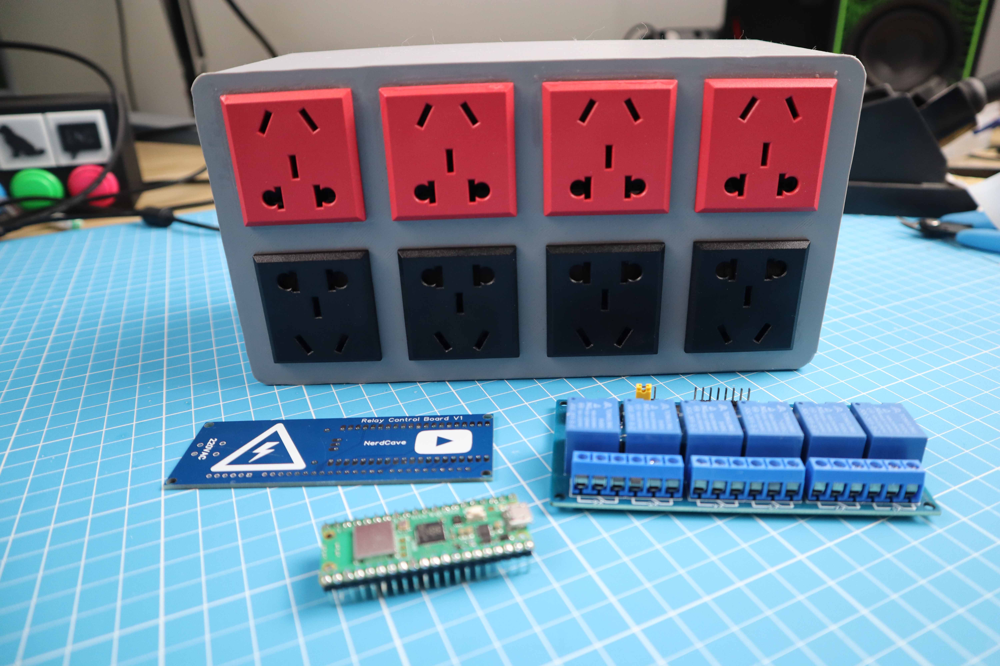
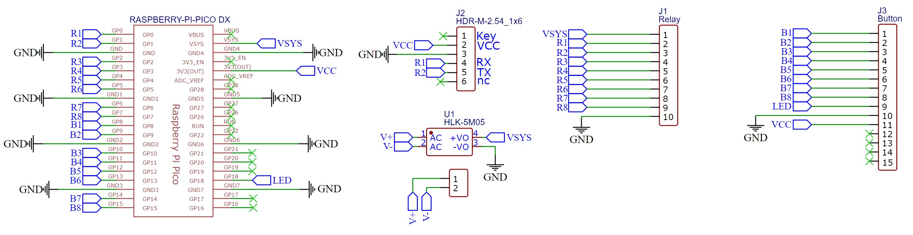
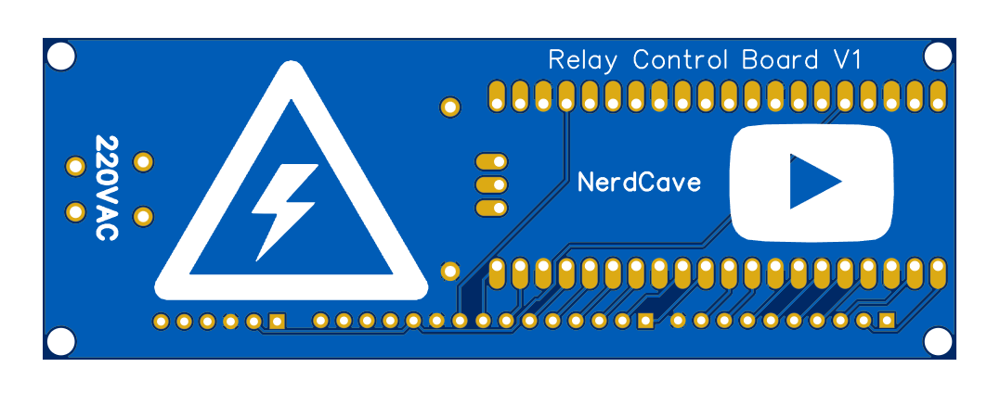

### YouTube Video
https://www.youtube.com/embed/seFGxxC4bDo

## Introduction

In this tutorial, I will be guiding you through the process of creating a smart multi-plug using the Raspberry Pi Pico W, an 8-channel relay board, and a custom-designed PCB. This smart multi-plug can control different electronic devices individually through a simple web interface.

**Disclaimer**: This tutorial involves the use of live alternating current and is for educational purposes only. If you want to recreate this project, please seek the guidance of a professional.

<figure><figcaption></figcaption></figure>

## Project Sponsors

Special thanks to JLCPCB who sponsored this project by providing the PCB. If you need any PCB for your projects, consider heading over to the JLCPCB website.

## Components + Tools Breakdown

| Components                | Quantity |
|---------------------------|----------|
| Raspberry Pi Pico W       | 1        |
| Custom PCB (JLCPCB)       | 1        |
| Wires (Jumer F-M)         | 10       |
| 22AWG single core         | 1.5m     |
| 8-Channel Relay Module    | 1        |
| 3D printed Parts          | Few      |
| Power Socket              | 1        |
| C14 Power module          | 1        |
| Miscellaneous (glue etc.) | Few      |


## Tools / Equipment

|Tools / Equipment / Software|
|----------------------------|
| Soldering Iron + Solder    | 
| Computer + Thonny IDE      |
| Screw driver               |


## Schematic Diagram&#x20;

The schematic diagram is shown below. The design is straightforward as each button was connected to a GPIO pin to the Raspberry Pi Pico W,&#x20;


<figure><figcaption></figcaption></figure>

#### Breadboard Testing

Before we start building the project, it is recommended to assemble everything on a breadboard first to test all the components.

## Designing the PCB

After testing, use EasyEDA to create the PCB. This board will make the project a lot easier to be used with the relay board. After double-checking the PCB board, place the order through JLCPCB.

<figure><figcaption></figcaption></figure>

### PCB ( JLCPCB )

The PCB was ordered through JLCPCB. They offer great PCBs at a low cost and have promotions and coupons available throughout the year. You can sign up using here, or using the following link:

[https://jlcpcb.com/?from=Nerd](https://jlcpcb.com/?from=Nerd) that will support me as a creator to keep making content that is assessable and open source at no charge to you.

Ordering the PCB is very simple:

Download the Gerber file [here](https://github.com/Guitarman9119/Raspberry-Pi-Pico-/tree/main/Wi-Fi%20Multi%20Plug)  or using the link: [https://github.com/Guitarman9119/Raspberry-Pi-Pico-/tree/main/Wi-Fi%20Multi%20Plug](https://github.com/Guitarman9119/Raspberry-Pi-Pico-/tree/main/Wi-Fi%20Multi%20Plug)

**Sign up through** [https://jlcpcb.com/?from=Nerd](https://jlcpcb.com/?from=Nerd)

Click on **Add Gerber file**

<figure><figcaption></figcaption></figure>

leave all the settings as default given. You might want change the PCB color which you can do here:

<figure><figcaption></figcaption></figure>

Enter you shipping details, save to cart

<figure><figcaption></figcaption></figure>

Then after a few days depending on your location you will receive your great quality PCB.

<figure><figcaption></figcaption></figure>


## Enclosure Design

Using the dimensions of the relay board and your PCB, design a case to hold everything. For this project, we used Fusion360 which is free to use with a hobby license.

### Printing the Case

Print out the case and use 100 percent infill to give it enough strength. Connect the relay board and PCB and connect the cables according to the provided diagram.\
The first version of the case is available here:

[https://github.com/Guitarman9119/Raspberry-Pi-Pico-/tree/main/Wi-Fi%20Multi%20Plug](https://github.com/Guitarman9119/Raspberry-Pi-Pico-/tree/main/Wi-Fi%20Multi%20Plug)


<figure><figcaption></figcaption></figure>

## Connecting the Outlets

The next part involves connecting all the outlets to the relay. A diagram is provided to show how it was done for each outlet.

<figure><figcaption></figcaption></figure>

## Programming the Raspberry Pi Pico W

Before closing everything or connecting power, we first need to write a program for the Raspberry Pi Pico W. Remember not to power the Pico through USB when external 5V is connected.

### Full Code

Here is the code for the project, save it on the Pico W as boot.py

```python
from machine import Pin
import network
import time
try:
  import usocket as socket
except:
  import socket
 
relay1=Pin(0,Pin.OUT)
relay2=Pin(1,Pin.OUT)
relay3=Pin(2,Pin.OUT)
relay4=Pin(3,Pin.OUT)
relay5=Pin(4,Pin.OUT)
relay6=Pin(5,Pin.OUT)
relay7=Pin(6,Pin.OUT)
relay8=Pin(7,Pin.OUT)

relay1.value(1)
relay2.value(1)
relay3.value(1)
relay4.value(1)
relay5.value(1)
relay6.value(1)
relay7.value(1)
relay8.value(1) 
 
wlan = network.WLAN(network.STA_IF)
wlan.active(True)
wlan.connect("Open_Internet", "25802580")       # ssid, password
 
# connect the network       
wait = 10
while wait > 0:
    if wlan.status() < 0 or wlan.status() >= 3:
        break
    wait -= 1
    print('waiting for connection...')
    time.sleep(1)

# Handle connection error
if wlan.status() != 3:
    raise RuntimeError('wifi connection failed')
else:
    print('connected')
    ip=wlan.ifconfig()[0]
    print('IP: ', ip)
 
 
def web_server():
  if relay1.value() == 1: relay_state1 = ''
  else: relay_state1 = 'checked'
  if relay2.value() == 1: relay_state2 = ''
  else: relay_state2 = 'checked'
  if relay3.value() == 1: relay_state3 = ''
  else: relay_state3 = 'checked'
  if relay4.value() == 1: relay_state4 = ''
  else: relay_state4 = 'checked'
  if relay5.value() == 1: relay_state5 = ''
  else: relay_state5 = 'checked'
  if relay6.value() == 1: relay_state6 = ''
  else: relay_state6 = 'checked'
  if relay7.value() == 1: relay_state7 = ''
  else: relay_state7 = 'checked'
  if relay8.value() == 1: relay_state8 = ''
  else: relay_state8 = 'checked'

  html = """
<html>
   <head>
    <meta charset="utf-8">
    <meta name="viewport" content="width=device-width, initial-scale=1">
      <meta name="viewport" content="width=device-width, initial-scale=1">
      <link href="https://cdn.jsdelivr.net/npm/bootstrap@5.3.1/dist/css/bootstrap.min.css" rel="stylesheet" integrity="sha384-4bw+/aepP/YC94hEpVNVgiZdgIC5+VKNBQNGCHeKRQN+PtmoHDEXuppvnDJzQIu9" crossorigin="anonymous">
      <style>
         body{font-family:Arial; text-align: center; margin: 0px auto; padding-top:30px;}
         .switch{position:relative;display:inline-block;width:120px;height:68px}.switch input{display:none}
         .slider{position:absolute;top:0;left:0;right:0;bottom:0;background-color:#ccc;border-radius:34px}
         .slider:before{position:absolute;content:"";height:52px;width:52px;left:8px;bottom:8px;background-color:#fff;-webkit-transition:.4s;transition:.4s;border-radius:68px}
         input:checked+.slider{background-color:#2196F3}
         input:checked+.slider:before{-webkit-transform:translateX(52px);-ms-transform:translateX(52px);transform:translateX(52px)}
      </style>
      <script>
      function toggleCheckbox(element,num) { 
        let relay_str = "relay" + num.toString();
        var xhr = new XMLHttpRequest(); 
        if(element.checked){ 
          xhr.open("GET", "/?relay=on".replace("relay",relay_str), true); 
          }
        else { 
          xhr.open("GET", "/?relay=off".replace("relay",relay_str), true); 
        } 
        xhr.send(); 
      }
      </script>
      <script src="https://cdn.jsdelivr.net/npm/bootstrap@5.3.1/dist/js/bootstrap.bundle.min.js" integrity="sha384-HwwvtgBNo3bZJJLYd8oVXjrBZt8cqVSpeBNS5n7C8IVInixGAoxmnlMuBnhbgrkm" crossorigin="anonymous"></script>
   </head>
   <body>
    <h1>Awesome Plug</h1>
    <h2>NerdCave</h2>
 
    <div class="container">
      <div class="row">
        <div class="col">
          <h2>Left-Light</h2>
        <label class="switch"><input type="checkbox" onchange="toggleCheckbox(this,1)" %s><span class="slider"></span></label>
        </div>
 
        <div class="col">
          <h2>Right-Light</h2>
          <label class="switch"><input type="checkbox" onchange="toggleCheckbox(this,2)" %s><span class="slider"></span></label>
        </div>
 
      </div>
 
      <div class="row">
        <div class="col">
          <h2>Charger</h2>
        <label class="switch"><input type="checkbox" onchange="toggleCheckbox(this,3)" %s><span class="slider"></span></label>
        </div>
 
        <div class="col">
          <h2>Fan</h2>
          <label class="switch"><input type="checkbox" onchange="toggleCheckbox(this,4)" %s><span class="slider"></span></label>
        </div>
 
      </div>
 
      <div class="row">
        <div class="col">
          <h2>Solder Station</h2>
        <label class="switch"><input type="checkbox" onchange="toggleCheckbox(this,5)" %s><span class="slider"></span></label>
        </div>
 
        <div class="col">
          <h2>Lamp</h2>
          <label class="switch"><input type="checkbox" onchange="toggleCheckbox(this,6)" %s><span class="slider"></span></label>
        </div>
 
      </div>
 
      <div class="row">
        <div class="col">
          <h2>LED</h2>
        <label class="switch"><input type="checkbox" onchange="toggleCheckbox(this,7)" %s><span class="slider"></span></label>
        </div>
 
        <div class="col">
          <h2>Camera</h2>
          <label class="switch"><input type="checkbox" onchange="toggleCheckbox(this,8)" %s><span class="slider"></span></label>
        </div>
        
      </div>
    </div>
   </body>
 
</html>
""" % (relay_state1, relay_state2, relay_state3, relay_state4, relay_state5, relay_state6, relay_state7, relay_state8)
  return html
 
s = socket.socket(socket.AF_INET, socket.SOCK_STREAM)
s.bind(('', 80))
s.listen(5)
 
while True:
  try:
    conn, addr = s.accept()
    conn.settimeout(3.0)
#    print('Got a connection from %s' % str(addr))
    request = conn.recv(1024)
    conn.settimeout(None)
    request = str(request)
 
#    print('Content = %s' % request)
    relay1_on = request.find('/?relay1=on')
    relay1_off = request.find('/?relay1=off')
    if relay1_on == 6:
      print('RELAY1 ON')
      relay1.value(0)
    if relay1_off == 6:
      print('RELAY1 OFF')
      relay1.value(1)
    relay2_on = request.find('/?relay2=on')
    relay2_off = request.find('/?relay2=off')
    if relay2_on == 6:
      print('RELAY2 ON')
      relay2.value(0)
    if relay2_off == 6:
      print('RELAY2 OFF')
      relay2.value(1)
 
    relay3_on = request.find('/?relay3=on')
    relay3_off = request.find('/?relay3=off')
    if relay3_on == 6:
      print('RELAY3 ON')
      relay3.value(0)
    if relay3_off == 6:
      print('RELAY3 OFF')
      relay3.value(1)
 
    relay4_on = request.find('/?relay4=on')
    relay4_off = request.find('/?relay4=off')
    if relay4_on == 6:
      print('RELAY4 ON')
      relay4.value(0)
    if relay4_off == 6:
      print('RELAY4 OFF')
      relay4.value(1)
 
    relay5_on = request.find('/?relay5=on')
    relay5_off = request.find('/?relay5=off')
    if relay5_on == 6:
      print('RELAY5 ON')
      relay5.value(0)
    if relay5_off == 6:
      print('RELAY5 OFF')
      relay5.value(1)
 
    relay6_on = request.find('/?relay6=on')
    relay6_off = request.find('/?relay6=off')
    if relay6_on == 6:
      print('RELAY3 ON')
      relay6.value(0)
    if relay6_off == 6:
      print('RELAY3 OFF')
      relay6.value(1)
 
    relay7_on = request.find('/?relay7=on')
    relay7_off = request.find('/?relay7=off')
    if relay7_on == 6:
      print('RELAY7 ON')
      relay7.value(0)
    if relay7_off == 6:
      print('RELAY3 OFF')
      relay7.value(1)
 
    relay8_on = request.find('/?relay8=on')
    relay8_off = request.find('/?relay8=off')
    if relay8_on == 6:
      print('RELAY8 ON')
      relay8.value(0)
    if relay8_off == 6:
      print('RELAY8 OFF')
      relay8.value(1)
      
    response = web_server()
    conn.send('HTTP/1.1 200 OK\n')
    conn.send('Content-Type: text/html\n')
    conn.send('Connection: close\n\n')
    conn.sendall(response)
    conn.close()
  except OSError as e:
    conn.close()
    print('Connection closed')
```

### Code explanation

### Importing Required Libraries

```python
from machine import Pin
import network
import time
try:
  import usocket as socket
except:
  import socket
```

We import `Pin` from the `machine` module to control the GPIO pins of the Raspberry Pi Pico W. The `network` module is used to connect to the Wi-Fi network. The `usocket` (or `socket` in case `usocket` is not available) module is used to create and manage the web server.

#### Initializing the Relay Pins

```python
relay1=Pin(0,Pin.OUT)
relay2=Pin(1,Pin.OUT)
relay3=Pin(2,Pin.OUT)
relay4=Pin(3,Pin.OUT)
relay5=Pin(4,Pin.OUT)
relay6=Pin(5,Pin.OUT)
relay7=Pin(6,Pin.OUT)
relay8=Pin(7,Pin.OUT)
```

We set up GPIO pins 0 to 7 as output pins, each controlling one of the eight relays.

#### Setting Initial State of Relays

```python
relay1.value(1)
relay2.value(1)
relay3.value(1)
relay4.value(1)
relay5.value(1)
relay6.value(1)
relay7.value(1)
relay8.value(1)
```

We set the initial state of all relays to 1 (OFF state).

#### Connecting to Wi-Fi

```python
wlan = network.WLAN(network.STA_IF)
wlan.active(True)
wlan.connect("NerdCave_internet", "8SUB8")       # ssid, password
```

We set up the Raspberry Pi Pico W to connect to the Wi-Fi network with the SSID and password provided.

#### Checking the Wi-Fi Connection

```python
wait = 10
while wait > 0:
    if wlan.status() < 0 or wlan.status() >= 3:
        break
    wait -= 1
    print('waiting for connection...')
    time.sleep(1)

if wlan.status() != 3:
    raise RuntimeError('wifi connection failed')
else:
    print('connected')
    ip=wlan.ifconfig()[0]
    print('IP: ', ip)
```

We wait for the Raspberry Pi Pico W to connect to the Wi-Fi network, and print the IP address once it is connected.

#### Defining the Web Server

```python
def web_server():
  if relay1.value() == 1: relay_state1 = ''
  else: relay_state1 = 'checked'
  ...
  ...
```

We define a function `web_server()` that checks the state of the relays and creates the HTML code for the web server. The HTML code includes JavaScript to handle the toggling of the relays through the checkboxes in the user interface.

#### Creating the Socket and Handling Connections

```python
s = socket.socket(socket.AF_INET, socket.SOCK_STREAM)
s.bind(('', 80))
s.listen(5)

while True:
  # Code to accept connections and handle HTTP requests
```

## Conclusion

This project does need a few improvements and will definetly come back to this in the future.
